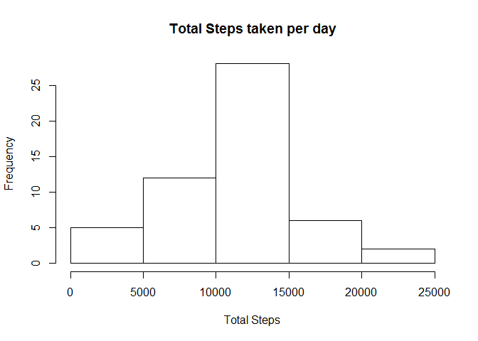
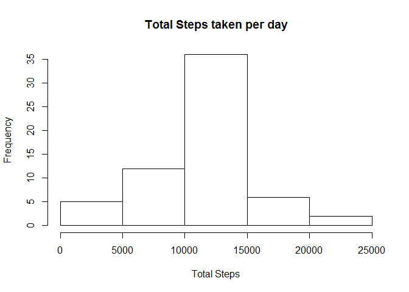
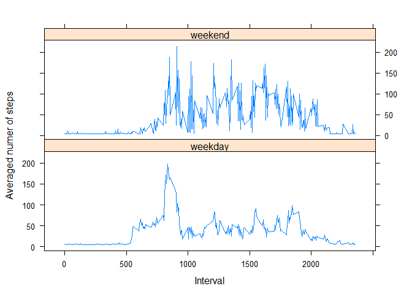

# PA_template1
mona  
Sunday, March 15, 2015  
---
<<<<<<< HEAD
title: "PA1.template"
author: "mona"
date: "Sunday, March 15, 2015"
output: html_document
---
This assignment makes use of data from a personal activity monitoring device. This device collects data at 5 minute intervals through out the day. The data consists of two months of data from an anonymous individual collected during the months of October and November, 2012 and include the number of steps taken in 5 minute intervals each day. The data for this assignment can be downloaded from the course web site.

The analysis steps and answers of individual questions in this assignment are mentioned separately.

##Procedure 1: Loading and preprocessing the data
 * Step 1: Load the data (i.e. read.csv()) in data set name "act"


```r
setwd("C:/Users/Ankur/Desktop/Monika/Course5/project")
act <- read.csv("activity.csv",sep=",",header=TRUE)
```

### Question 1: What is mean total number of steps taken per day?
### Question 2: create a histogram
Using aggregate function, sum up all steps taken in a day , step is new data set
  

```r
step <- aggregate(steps~date,FUN=sum,data=act)
head(step)
```

```
##         date steps
## 1 2012-10-02   126
## 2 2012-10-03 11352
## 3 2012-10-04 12116
## 4 2012-10-05 13294
## 5 2012-10-06 15420
## 6 2012-10-07 11015
```

```r
hist(step$steps,xlab="Total Steps", main="Total Steps taken per day")
```

 


### Question 3: Calculate and report the mean and median of the total number of steps taken per day


```r
 mean (step$steps)
```

```
## [1] 10766.19
```

```r
 median(step$steps)
```

```
## [1] 10765
```

# Question 2 What is the average daily activity pattern?

* P1. Make a time series plot of the 5-minute interval (x-axis) and the average number of steps taken, averaged across all days (y-axis)


```r
stepinterval <- aggregate(steps~interval,FUN= sum, data= act)

barplot(stepinterval$steps,names.arg=stepinterval$interval,
        xlab="interval", ylab="steps taken")
```

 

*
*P2. Which 5-minute interval, on average across all the days in the dataset, contains the maximum number of steps?

```r
subset(stepinterval,select = interval, steps==max(steps))
```

```
##     interval
## 104      835
```

### Imputing missing values
* Calculate and report the total number of missing values in the dataset (i.e. the total number of rows with NAs)

```r
nrow(a<-act[!complete.cases(act),])
```

```
## [1] 2304
```
* Devise a strategy for filling in all of the missing values in the dataset. strategy i used is mean of per interval


```r
s<-mean(step$steps)/288
```
*Create a new dataset that is equal to the original dataset but with the missing data filled in.

```r
new_act <- act
new_act[is.na(new_act$steps),]$steps<- s
```

* Make a histogram of the total number of steps taken each day with new data set


```r
step1 <- aggregate(steps~date,FUN=sum,data=new_act)
hist(step1$steps,xlab="Total Steps", main="Total Steps taken per day")
```

 

*Calculate and report the mean and median total number of steps taken per day. Do these values differ from the estimates from the first part of the assignment? What is the impact of imputing missing data on the estimates of the total daily number of steps?


```r
mean(step1$steps)
```

```
## [1] 10766.19
```

```r
median(step1$step)
```

```
## [1] 10766.19
```
mean is same , but there is slight difference in median values.

###Are there differences in activity patterns between weekdays and weekends?

* For this part the weekdays() function may be of some help here. Use the dataset with the filled-in missing values for this part.

* Create a new factor variable in the dataset with two levels - "weekday" and "weekend" indicating whether a given date is a weekday or weekend day.


```r
new_act$day<-as.factor(ifelse(weekdays(as.Date(new_act$date))==c("Saturday","Sunday"),"weekend", "weekday"))
```

* Make a panel plot containing a time series plot

```r
newdata<- aggregate(steps~interval+day, data=new_act, mean)
library(lattice)
 xyplot(steps~interval|day, data=newdata, type="l", layout = c(1,2),  xlab="Interval", ylab="Averaged numer of steps")
```

 
=======
title: "Reproducible Research: Peer Assessment 1"
output: 
  html_document:
    keep_md: true
---


## Loading and preprocessing the data


## What is mean total number of steps taken per day?


## What is the average daily activity pattern?


## Imputing missing values


## Are there differences in activity patterns between weekdays and weekends?
>>>>>>> 80edf39c3bb508fee88e3394542f967dd3fd3270
